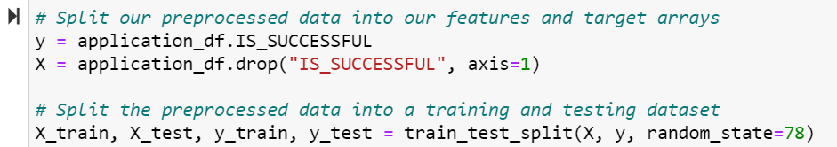
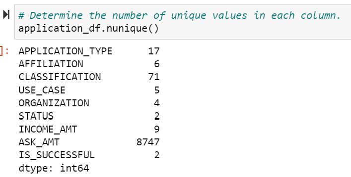
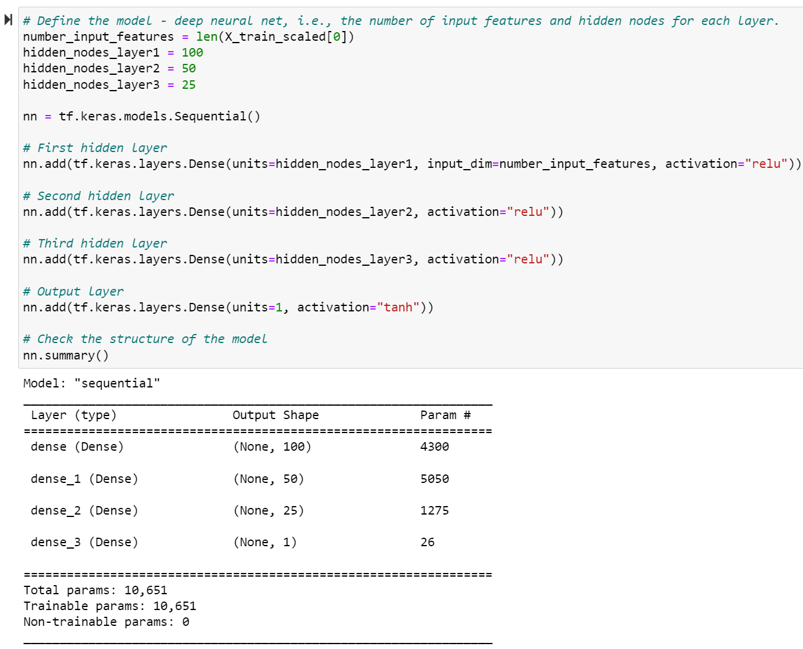
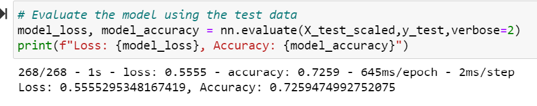

# Neural_Network_Charity_Analysis

# Purpose

Where a foundation should make investments in, is the clients inquiry. A binary classifier able to predict applicants success rate if Alphabet Soup funds them.

# Results

## Processing Data for Neural Network Model

## What variable(s) are considered the target(s) for your model?

The "IS_SUCCESFUL" column was the target variable

## What variable(s) are considered to be the features for your model?

Original features included:

EIN, NAME, APPLICATION_TYPE, AFFILIATION, CLASSIFICATION, USE_BASE, ORGANIZATION, STATUS, INCOME_AMT, SPECIAL_CONSIDERATIONS, ASK_AMT, IS_SUCCESSFUL

## What variable(s) are neither targets nor features, and should be removed from the input data?

EIN and NAME columns were removed

# Complie, Train, Evaluate, and Optimize the Model

## How many neurons, layers, and activation functions did you select for your neural network model, and why?

- Two hidden nodes lay within the first layer at 80 input/neurons.
- 30 input/neurons are within the second layer.
- Two total hidden layers and an output layer lay within this Neural Network model, each
  containing activation functions: "relu" / "relu" and "sigmoid".

## Were you able to achieve the target model performance?

The model did't meet the 75% target. 72.5% was the recorded accuracy with a loss of 55%.

## What steps did you take to try and increase model performance?

- Attempt #1:
Removed additional variable "SPECIAL_CONSIDERATIONS", from the data set.

- Attempt #2:
Amount of neurons were adjusted on layers.

- Attempt3:
Changed "sigmoid" output layer to "tanh".

# Summary

The 75% accuracy was not met, even after attempts to optimize the model. The new optimized results were only able to reach 72.5% - 72.8%.

The variables seem reliable for further research and optimization. For instance, "ASK_AMT" has 8,747 unique values. Bins for ranges could possibly be made regarding these unique values and could decrease the amount of unique values and improve overall accuracy for the model.
